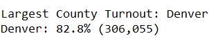

# Colorado's 2018 1st District Congress Elections Analysis with Python

## Overview of Election Audit
Based on the 2018 Colorado 1st</sup.> district Congress Elections, we'll find out the votes and percentages of the running candidates and the counties of the precinct. All the results are saved in the election_analysis.txt file on the Resource folder.

## Election-Audit Results
* There was a total of 369,711 votes casted in this election.
* Counties Votes and Percentage Breakdown\
\
* Largest County Turnout\
\
* Candidate Votes and Percentages Breakdown\
\
* Winning Candidate Votes and Percentage\
\

## Election-Audit Summary
Even though we are showing the 2018 Colorado's 1st District Congress results, this script could easily be modified to include all districts and candidates. We will iterate over each district, obtaining all the candidates and counties and obtaining all the necessary calculations for the audit.
1. Initilize a dictionary with all the districts and their election results file name. It is easier if this information was written in a csv file.

2. Create a loop over the dictionary that contains all the script and replace the hardcoded path with the election result file of the dictionary.

3. Add the district's name to the Total Votes print and write statements.

